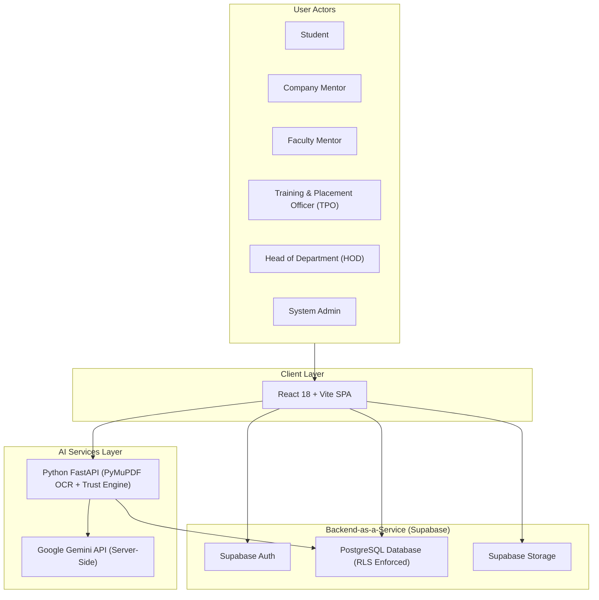
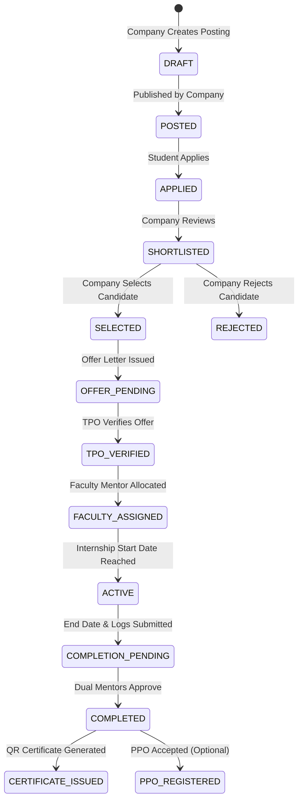
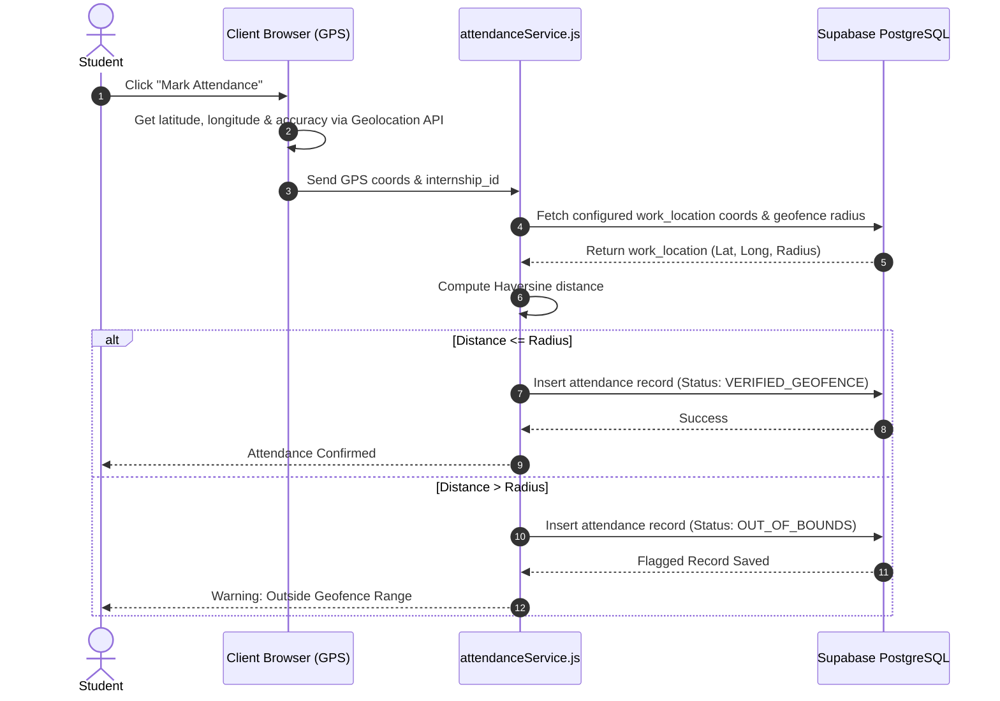

# ARCHITECTURE.md — InterTrack System Architecture

**Document Version:** 2.0  
**Status:** System Architecture Source of Truth  
**Project:** InterTrack — AI-Powered Internship Management & Verification Platform  

---

## 1. Architecture Overview

**InterTrack** is an end-to-end college internship lifecycle and verification platform. It digitizes, connects, and verifies every stage of the student internship journey—from academic profile eligibility, company posting, application, selection, offer letter verification, faculty mentor assignment, real-time GPS-geofenced daily attendance, daily work logs, task management, progress aggregation, dual mentor evaluations, completion approval, digital certificate generation, external AI certificate verification, PPO tracking, and institutional analytics.

Rather than treating attendance or certificate verification as isolated modules, InterTrack functions as an integrated **chain of evidence system** backed by a **Single Source of Truth** architecture on Supabase PostgreSQL.

---

## 2. Architecture Principles

1. **Single Source of Truth:** Every domain entity has exactly one authoritative data source in the database. Duplicate role-specific tables (e.g., separate student attendance vs mentor attendance tables) are strictly prohibited.
2. **Reuse Before Create:** Inspect and leverage existing codebase structures, services, components, and schema migration scripts before creating new definitions.
3. **Real Database Persistence:** All business operations, check-in logs, evaluations, and verification statuses must persist directly to Supabase PostgreSQL. Relying on `localStorage` or unpersisted mock states as sources of truth is disallowed.
4. **Human Authority for Institutional Decisions:** AI models (Certificate Analyzer, Monthly AI Summaries, Risk Monitors) function purely as advisory assistants. Authorized human reviewers (Faculty, TPO, HOD, Admin) remain authoritative.
5. **Data Layer Security:** Access boundaries are enforced at the database level using Supabase Row Level Security (RLS) policies and server-side authorization, never relying solely on frontend client routes.
6. **Strict Secret Isolation:** Privileged API keys (Google Gemini API, Supabase Service Role Key) MUST remain strictly server-side and never be exposed in client-facing `VITE_` frontend environment variables.

---

## 3. System Context



---

## 4. High-Level Architecture

The system follows a decoupled, monolithic client architecture connected to Supabase BaaS and a Python FastAPI backend for AI processing:

```text
                      USERS
                        │
                React Web Application (Vite)
                        │
                Role-Based UI / Guarded Routes
                        │
                   Service Layer
                        │
        ┌───────────────┴───────────────┐
        ▼                               ▼
Supabase Platform                Python AI Service
  ├── Auth (JWT)                   ├── FastAPI Server
  ├── PostgreSQL Database (RLS)    ├── PyMuPDF OCR & Trust Engine
  ├── Supabase Storage             └── Google Gemini API Proxy
  └── Realtime Listeners                │
        │                               │
        └───────────────┬───────────────┘
                        ▼
             Trusted Internship Data
                        ▼
             Role-Specific Dashboards
```

---

## 5. Technology Stack

| Layer | Component | Description / Function |
| :--- | :--- | :--- |
| **Frontend UI** | React 18 + Vite 5 | SPA Rendering, Component Lifecycle, Fast Refresh |
| **Styling & Icons** | Tailwind CSS + Lucide React | Utility-first CSS, responsive styling, standard icon set |
| **Form & Validation** | React Hook Form + Zod | Uncontrolled form handling, schema-based client-side validation |
| **Routing** | React Router DOM v6 | Protected client-side routing, role layouts |
| **Charts & Alerts** | Recharts + React Hot Toast | Data visualization and non-blocking toast notifications |
| **Backend & Auth** | Supabase Auth + JWT | Session management, role claims, email verification |
| **Database** | Supabase PostgreSQL | Relational DB system of record, RLS policies, triggers |
| **Storage** | Supabase Storage | Encrypted/private bucket storage for offer letters, resumes, certificates |
| **AI Certificate Engine** | Python 3 + FastAPI | PyMuPDF, OCR pipeline, SHA-256 duplicate engine, Trust Engine |
| **AI Insights Engine** | Google Gemini API | Server-side LLM for Monthly Summaries and Risk Monitoring |

---

## 6. Frontend Architecture

The React codebase resides in `src/` structured cleanly by architectural responsibility:

```text
src/
├── assets/          # Static branding, logo assets, and CSS styles
├── components/      # UI components divided into common/ and role-specific folders
│   ├── common/      # Reusable primitives (Button, Input, Card, Drawer, Queue)
│   ├── student/     # Student portal components (AttendanceMarker, WorkLogForm)
│   ├── company/     # Company portal components (TaskAssignment, VerificationTable)
│   ├── faculty/     # Faculty portal components (AssignedStudents, ReviewTabs)
│   ├── tpo/         # TPO governance components
│   ├── hod/         # HOD analytics components
│   └── admin/       # Admin configuration components
├── pages/           # View route entry points by role domain
├── layouts/         # Role-based shell layouts (StudentLayout, FacultyLayout, etc.)
├── services/        # 18 Supabase integration services (auth, attendance, task, etc.)
├── context/         # AuthContext.jsx (Global user session, role claims, auth state)
├── routes/          # ProtectedRoute.jsx and app routing configuration
├── hooks/           # Custom React hooks (useAuth, useAttendance, useTasks)
├── utils/           # Pure utility helpers (haversine Geofence, date formatters)
└── constants/       # Enums, roles, status constants
```

---

## 7. Backend / Service Architecture

The system maintains a strict separation of concerns between client operations and privileged backend operations:

```text
[React Client] ──(Anon JWT)──► [Supabase PostgreSQL (RLS Enforced)]
      │
      └──(Auth Request)──► [Python FastAPI AI Service]
                                │
                                ├──► [PyMuPDF OCR / Trust Engine]
                                ├──► [Google Gemini API (API Key Server-Side)]
                                └──► [Supabase Service Role Client] ──► [PostgreSQL]
```

- **Frontend Service Layer:** Interacts with Supabase using `@supabase/supabase-js` under authenticated user credentials constrained by database RLS rules.
- **Python FastAPI Service:** Handles resource-heavy OCR, PDF parsing, Trust Engine calculations, and proxies requests to the Google Gemini API using server-side keys (`GEMINI_API_KEY`, `SUPABASE_SERVICE_ROLE_KEY`).

---

## 8. Supabase Architecture

1. **Supabase Auth:** Manages registration, authentication, JWT token generation, and user roles stored in JWT user metadata.
2. **Supabase PostgreSQL:** Primary system of record for all entities, enforce relational constraints (`FOREIGN KEY`, `ON DELETE CASCADE`), indexes, and triggers.
3. **Supabase Storage:** Buckets configured with access controls:
   - `resumes`: Private bucket for student resumes.
   - `offer_letters`: Private bucket for verified offer letters.
   - `task_deliverables`: Private bucket for task submissions.
   - `certificates`: Public/Signed URL bucket for completion certificates.
4. **Row Level Security (RLS):** Declarative SQL security policies enforced directly on PostgreSQL tables.

---

## 9. Database Domain Architecture

Logical table entities are grouped into 8 operational domains:

```text
1. IDENTITY DOMAIN
   ├── public.users
   ├── public.student_profiles
   └── public.departments

2. STAKEHOLDERS DOMAIN
   ├── public.companies
   ├── public.faculty_mentors
   └── public.company_mentors

3. OPPORTUNITY DOMAIN
   ├── public.internship_postings
   ├── public.internship_applications
   └── public.offer_letters

4. ACTIVE INTERNSHIP DOMAIN
   ├── public.internships (Master Record)
   ├── public.work_locations (Geofence coordinates)
   ├── public.attendance (Single Source of Truth)
   ├── public.work_logs
   ├── public.tasks
   └── public.task_submissions

5. PROGRESS & EVALUATION DOMAIN
   ├── public.weekly_monthly_progress
   ├── public.company_evaluations
   └── public.faculty_evaluations

6. COMPLETION DOMAIN
   ├── public.certificates
   └── public.ppo_records

7. AI VERIFICATION DOMAIN
   ├── public.external_certificates
   └── public.ml_certificate_dataset

8. GOVERNANCE DOMAIN
   └── public.audit_logs
```

---

## 10. Database Relationship Overview

```text
users
  │
  ├──► student_profiles (1:1)
  ├──► faculty_mentors (1:1)
  └──► company_mentors (1:1)
         │
companies ◄──────┘
  │
  ├──► internship_postings (1:N)
  │      └──► internship_applications (1:N)
  │             └──► offer_letters (1:1)
  │                    │
  └────────────────────┴──► internships (Master 1:N)
                              ├──► work_locations (1:1)
                              ├──► attendance (1:N)
                              ├──► work_logs (1:N)
                              ├──► tasks (1:N) ──► task_submissions (1:N)
                              ├──► company_evaluations (1:1)
                              ├──► faculty_evaluations (1:1)
                              ├──► certificates (1:1)
                              └──► ppo_records (1:1)
```

---

## 11. Authentication & RBAC Architecture

Six system roles govern platform authorization:

1. **Student:** Access limited strictly to personal profiles, eligible postings, owned applications, check-ins, work logs, assigned tasks, evaluations, and certificates.
2. **Company Mentor:** Scope limited to company details, postings, applicants, and assigned interns under their `company_id`.
3. **Faculty Mentor:** Scope limited to assigned student mentees matching their `faculty_id`.
4. **Head of Department (HOD):** Read/write scope dynamically restricted to students and internships matching their authenticated `department_id`.
5. **Training & Placement Officer (TPO):** Read/write scope across all institutional internship records, offer verifications, placement readiness data, and analytics.
6. **College Administrator:** Global governance, user role assignment, company management, and system audit logs.

---

## 12. RLS / Data Isolation Architecture

All database tables MUST enable Row Level Security (`ALTER TABLE <name> ENABLE ROW LEVEL SECURITY`). Examples:

- **Student Policy (`attendance`):**
  ```sql
  CREATE POLICY "Student check own attendance" ON public.attendance
  FOR ALL USING (
    internship_id IN (
      SELECT id FROM public.internships WHERE student_id = auth.uid()
    )
  );
  ```
- **HOD Dynamic Scope Policy (`student_profiles`):**
  ```sql
  CREATE POLICY "HOD view department students" ON public.student_profiles
  FOR SELECT USING (
    department = (
      SELECT department FROM public.faculty_mentors WHERE user_id = auth.uid()
    )
  );
  ```

---

## 13. Internship Lifecycle State Machine



---

## 14. Attendance & GPS Architecture



### Attendance Single Source of Truth
ONE `attendance` table row is created per check-in. The **SAME** record is queried directly by Student, Company Mentor, Faculty Mentor, and HOD dashboards.

---

## 15. Work Logs, Tasks & Progress Aggregation

```text
[Daily Attendance Logs]  ──┐
[Daily Work Logs]        ──┼──► [Progress Aggregator Service] ──► [weekly_monthly_progress]
[Task Submission Ratings] ──┤                                            │
[Mentor Feedback Ratings]──┘                                            ▼
                                                              [Gemini AI Summary Service]
                                                                        │
                                                                        ▼
                                                              [Monthly Progress Insights]
```

- **Daily Work Logs:** Simple Markdown/Text entries linked to `internship_id`.
- **Task Deliverables:** Assigned by Company/Faculty mentors with due dates, file attachments, and submission review ratings (1–5 scale).
- **Progress Scores:** Computed automatically from attendance percentages, task completion ratios, and average mentor ratings.

---

## 16. Dual Evaluation Architecture

To ensure academic and industry alignment, internship completion requires two independent evaluation submissions linked to the master `internships` record:

1. **Company Mentor Evaluation:** Evaluates technical competency, punctuality, professional conduct, work quality, and project output.
2. **Faculty Mentor Evaluation:** Evaluates academic alignment, weekly report quality, learning outcome achievement, and presentation skills.

Both evaluations must be marked `APPROVED` for the status to transition to `COMPLETED`.

---

## 17. Document Management Architecture

```text
Uploaded File ──► Frontend Validation (MIME type, size < 10MB) 
                ──► Supabase Private Storage Bucket 
                ──► Storage Path & SHA-256 Saved in PostgreSQL Metadata Table
```

- **Sensitive Documents:** Resumes, offer letters, task files, and PPO letters are stored in private Supabase Storage buckets accessible only via signed URLs generated on-demand for authorized roles.

---

## 18. Certificate AI Architecture (External Verification)

Preserves the existing verification pipeline:

```text
Uploaded PDF ──► SHA-256 Hash ──► Duplicate Check
                      │
                      ▼
               PyMuPDF OCR Extraction
                      │
                      ▼
               Field Extraction & Anomaly Detection
                      │
                      ▼
               Trust Engine Evaluation (0 - 100% Score)
                      │
                      ▼
               Advisory AI Recommendation (AUTO_VERIFIED / MANUAL_REVIEW / SUSPICIOUS)
                      │
                      ▼
               Supabase Persistence (`external_certificates` & `ml_certificate_dataset`)
                      │
                      ▼
               Authoritative Human Review (Faculty / TPO / HOD / Admin)
```

---

## 19. Gemini AI Architecture

Google Gemini API integration functions strictly server-side through the Python `ai_service` FastAPI proxy:

1. **Monthly AI Summaries:** Takes aggregated attendance rates, task scores, and work logs, generates structured prompts, calls Gemini API, and outputs concise monthly student progress summaries.
2. **Internship Risk Monitor:** Analyzes attendance degradation trends, inactive work log gaps, overdue tasks, and missing evaluations, outputting risk status (`NORMAL`, `ATTENTION NEEDED`, `HIGH ATTENTION`) with transparent reasons.
3. **PVI Protection:** Student names and personal identifiers are scrubbed or anonymized before sending context payloads to the Gemini API.

---

## 20. Analytics Architecture

Analytics dashboards query PostgreSQL directly using role-scoped SQL aggregations:

- **TPO Dashboard:** Total active internships, placement readiness distribution, company participation, stipend averages, PPO conversion rates, and pending offer verifications.
- **HOD Dashboard:** Department-scoped active internships, department attendance averages, student progress rates, and completion stats.
- **Admin Dashboard:** System-wide user statistics, storage utilization, security audit trails, and global performance metrics.

---

## 21. Audit Logging Architecture

Every security-sensitive operation generates an immutable `audit_logs` record:

```sql
INSERT INTO public.audit_logs (user_id, action, module, details, timestamp)
VALUES (auth.uid(), 'OFFER_VERIFIED', 'TPO_MODULE', '{"application_id": "..."}', NOW());
```

Tracked events include authentication, offer verification, faculty allocation, attendance check-in, task grading, evaluation submission, certificate verification, and role updates.

---

## 22. Role-to-Data Access Matrix

| Data Domain | Student | Company Mentor | Faculty Mentor | TPO | HOD | Admin |
| :--- | :--- | :--- | :--- | :--- | :--- | :--- |
| **User Profiles** | OWN | NONE | ASSIGNED | INSTITUTION | DEPARTMENT | GLOBAL |
| **Postings** | READ_ELIGIBLE | COMPANY_OWNED | READ_ALL | INSTITUTION | READ_ALL | GLOBAL |
| **Applications** | OWN | COMPANY_OWNED | ASSIGNED | INSTITUTION | DEPARTMENT | GLOBAL |
| **Offer Letters** | OWN | COMPANY_OWNED | ASSIGNED | INSTITUTION | DEPARTMENT | GLOBAL |
| **Internships** | OWN | COMPANY_ASSIGNED | ASSIGNED | INSTITUTION | DEPARTMENT | GLOBAL |
| **Attendance** | OWN | COMPANY_ASSIGNED | ASSIGNED | INSTITUTION | DEPARTMENT | GLOBAL |
| **Work Logs** | OWN | COMPANY_ASSIGNED | ASSIGNED | INSTITUTION | DEPARTMENT | GLOBAL |
| **Tasks** | OWN | COMPANY_ASSIGNED | ASSIGNED | INSTITUTION | DEPARTMENT | GLOBAL |
| **Evaluations** | READ_OWN | WRITE_COMPANY | WRITE_FACULTY | INSTITUTION | DEPARTMENT | GLOBAL |
| **Certificates** | OWN | COMPANY_ASSIGNED | ASSIGNED | INSTITUTION | DEPARTMENT | GLOBAL |
| **PPO Records** | OWN | COMPANY_ASSIGNED | ASSIGNED | INSTITUTION | DEPARTMENT | GLOBAL |
| **Analytics** | OWN | COMPANY | ASSIGNED | INSTITUTION | DEPARTMENT | GLOBAL |
| **Audit Logs** | NONE | NONE | NONE | INSTITUTION | DEPARTMENT | GLOBAL |

---

## 23. Security Architecture

1. **Authentication:** Supabase Auth with JWT token rotation.
2. **Authorization:** Database Row Level Security (RLS) policies.
3. **Secret Isolation:** `GEMINI_API_KEY` and `SUPABASE_SERVICE_ROLE_KEY` reside exclusively in server environment files (`ai_service/.env`).
4. **File Security:** Private Supabase Storage buckets with short-lived signed URLs.
5. **Input Validation:** Zod schemas on frontend; PostgreSQL type constraints on backend.

---

## 24. Error & Failure Handling

- **GPS Failures:** Out-of-bounds check-ins trigger explicit `OUT_OF_BOUNDS` status tags rather than crashing. Missing browser GPS permissions prompt UI guidance to enable location services.
- **AI Service Downtime:** If PyMuPDF OCR or Gemini API is unreachable, external certificates fallback gracefully to `MANUAL_REVIEW` queue without blocking human workflow.
- **Database/RLS Denial:** Toast notifications display actionable error messages (`Permission denied for department scope`).

---

## 25. Environment & Secret Management

| Variable Name | Exposure Scope | Purpose |
| :--- | :--- | :--- |
| `VITE_SUPABASE_URL` | Client (Public) | Supabase Project Gateway URL |
| `VITE_SUPABASE_ANON_KEY` | Client (Public) | Supabase Client Anonymous API Key |
| `SUPABASE_URL` | Server (Private) | Backend Python Supabase Gateway |
| `SUPABASE_SERVICE_ROLE_KEY` | Server (Private) | Backend Privileged Admin Key |
| `GEMINI_API_KEY` | Server (Private) | Google Gemini API Authentication Key |

---

## 26. Protected & Existing Components

The architecture explicitly protects and reuses the following verified codebase elements:

- Existing Supabase Client Configuration (`src/supabase/supabaseClient.js`)
- Existing Authentication Service (`src/services/authService.js`)
- Existing Attendance Service (`src/services/attendanceService.js`)
- Existing PyMuPDF OCR & Trust Engine (`ai_service/trust_engine.py`)
- Existing Anomaly Detector (`ai_service/anomaly_detector.py`)
- Existing Final Quality Gate (`ai_service/final_quality_gate.py`)
- Existing ML Safety Blocker (`ai_service/ml_training_blocker.py`)
- Existing Audit Logging Infrastructure

---

## 27. Phase Implementation Dependency Roadmap

```text
Phase 0: Database Contract & Schema Refinement (Single Source of Truth)
  ↓
Phase 1: Auth, RBAC & Department Scope Enforcers
  ↓
Phase 2: Student Profile & Academic Eligibility Engine
  ↓
Phase 3: Company Opportunity Posting & Application Workflow
  ↓
Phase 4: Selection, Offer Letter Upload & TPO Verification
  ↓
Phase 5: Faculty Mentorship Assignment Workflow
  ↓
Phase 6: Active Internship Engine (GPS Geofenced Attendance)
  ↓
Phase 7: Work Logs & Task Submission Engine
  ↓
Phase 8: Weekly & Monthly Progress Aggregator
  ↓
Phase 9: Dual Evaluation Engine (Company Mentor + Faculty Mentor)
  ↓
Phase 10: Completion Approval, PPO Tracking & Digital Certificate Generation
  ↓
Phase 11: AI Certificate Verification & Trust Engine
  ↓
Phase 12: Gemini API Integration (Monthly AI Summaries & Risk Monitor)
  ↓
Phase 13: Institutional & Departmental Analytics (TPO / HOD / Admin Dashboards)
  ↓
Phase 14: End-to-End System Audit, RLS Verification & Demo Readiness
```

---

## 28. Architecture Constraints

- **No Duplicate Tables:** Strict single source of truth for all domain models.
- **No Hardcoded Scope:** HOD and Faculty access MUST be dynamically resolved via database relationships.
- **No Client-Side Secrets:** Gemini and Supabase Admin keys must never be packaged into Vite bundles.
- **No Autonomous AI Authority:** AI decisions are advisory; human approval is authoritative.
- **No Mock State Shortcuts:** Real database persistence required across all implementation phases.

---

## 29. Architecture Definition of Done

`ARCHITECTURE.md` is complete when it provides:
- Complete logical & physical system architecture
- Exhaustive technology stack mapping
- Database domain models & relationship definitions
- Role-to-Data Access Matrix & RLS security model
- End-to-end internship state machine
- GPS geofenced attendance sequence flow
- AI integration architecture (Certificate OCR + Gemini LLM)
- Implementation phase dependency roadmap

---
**End of ARCHITECTURE.md Source of Truth Document**
